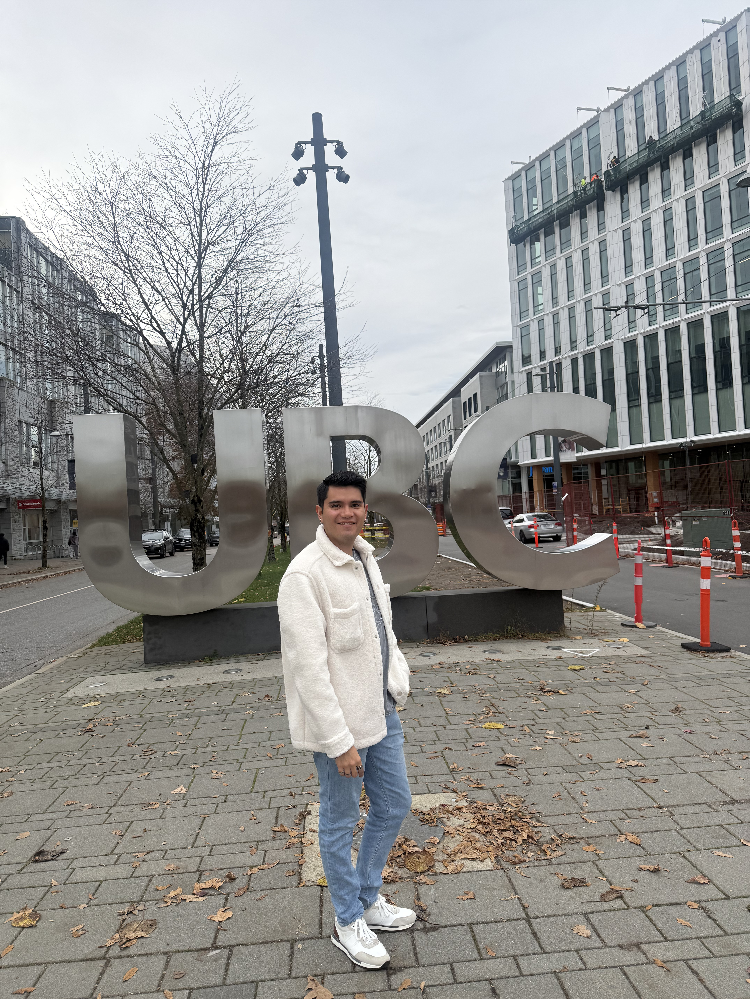

The first weeks of the program have been a different kind of intensity. Between programming for data science and statistics and probability, 
I've gone from "comfortable with code" to relearning how to think about problems the way this program wants me to: rigorously and reproducibly.

Even with that intensity, I've been lucky to meet really interesting people who are in the same boat. We're sharing this experience together, and I'm grateful for that. 
Coming from such a diverse range of backgrounds, it feels good to be able to rely on them — and to be relied on — even though we only met a few weeks ago.